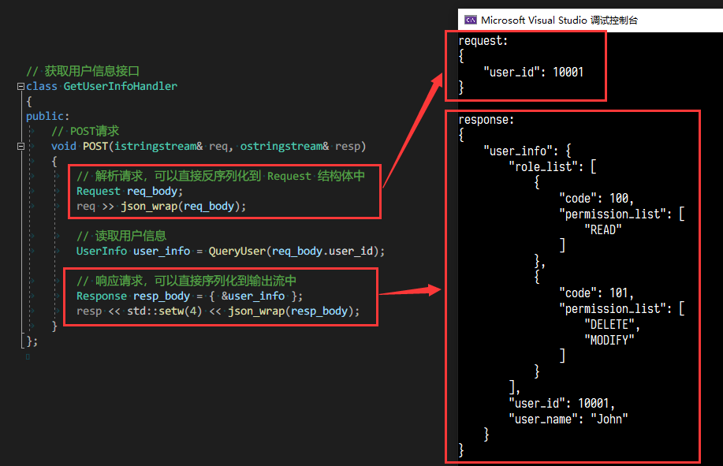

<!--  -->

# configor

<!-- [](https://open.vscode.dev/Nomango/configor) -->
[](https://open.vscode.dev/Nomango/configor)
[](https://github.com/Nomango/configor/actions)
[](https://www.codacy.com/gh/Nomango/configor/dashboard?utm_source=github.com&amp;utm_medium=referral&amp;utm_content=Nomango/configor&amp;utm_campaign=Badge_Grade)
[](https://codecov.io/gh/Nomango/configor)
[](https://github.com/Nomango/configor/releases/latest)
[](https://github.com/Nomango/configor/blob/master/LICENSE)

一个为 C++11 量身打造的轻量级 config 库，轻松完成 JSON 解析和序列化功能，并和 C++ 输入输出流交互。

### 功能

- 仅头文件，低接入成本
- STL-like，低学习成本
- 与标准库 io 交互
- 非侵入式的序列化与反序列化
- Unicode与多编码支持（支持`char`、`wchar_t`、`char16_t`和`char32_t`）
- 可扩展的输入输出方式

> 注意：项目仍处于开发状态，可能有不兼容的修改。

### 关于更名！

项目此前叫做 `jsonxx`，现已更名为 `configor`！

在保证原有 API 可用的情况下，将在未来支持包括 JSON 在内的各种常见对象存储格式（如 YAML 等）。

如果您之前已经在使用 jsonxx，那么升级到 configor 将非常简单，只需要修改头文件的声明如下：

```cpp
// 替换掉注释中的头文件，改为使用下方的头文件即可
// #include "jsonxx/json.hpp"
// using namespace jsonxx;
#include "configor/json.hpp"
using namespace configor;
```

### 目录

- [快速上手](#快速上手)
  - [取值方式](#取值方式)
  - [常用方法和运算符](#常用方法和运算符)
- 序列化与反序列化
  - [序列化](#序列化)
  - [反序列化](#反序列化)
  - [Unicode与多编码支持](#Unicode与多编码支持)
  - [与自定义类型转换](#与自定义类型转换)
- [示例代码](#示例代码)
- [常见问题](#常见问题)
- [更多](#更多)
- [计划](#计划)

### 快速上手

- 引入 configor 头文件

```cpp
#include "configor/json.hpp"
using namespace configor;
```

- 快速完成自定义类型与 JSON 转换

```cpp
struct User {
    std::string name;
    int age;

    // 一行代码完成字段绑定
    CONFIGOR_BIND(json, User, REQUIRED(name), OPTIONAL(age))
};

// User 转换到 json
json j = User{"John", 18};
// json 转换到 User
User u = json({{"name", "John"}, {"age", 18}});
```

- 使用 C++ 的方式的创建 JSON 对象

使用 `operator[]` 为 JSON 对象赋值

```cpp
json j;
j["number"] = 1;
j["float"] = 1.5;
j["string"] = "this is a string";
j["boolean"] = true;
j["user"]["id"] = 10;
j["user"]["name"] = "Nomango";
```

使用 `std::initializer_list` 为 JSON 对象赋值

```cpp
// 使用初始化列表构造数组
json arr = { 1, 2, 3 };
// 使用初始化列表构造对象
json obj = {
    {
        "user", {
            { "id", 10 },
            { "name", "Nomango" }
        }
    }
};
// 第二个对象
json obj2 = {
    { "nul", nullptr },
    { "number", 1 },
    { "float", 1.3 },
    { "boolean", false },
    { "string", "中文测试" },
    { "array", { 1, 2, true, 1.4 } },
    { "object", {
        { "key", "value" },
        { "key2", "value2" },
    }},
};
```

使用辅助方法构造数组或对象

```cpp
json arr = json::array({ 1 });
json obj = json::object({ { "user", { { "id", 1 }, { "name", "Nomango" } } } });
```

### 取值方式

- 判断 JSON 对象的值类型

```cpp
// 判断 JSON 值类型
bool is_null();
bool is_bool();
bool is_integer();
bool is_float();
bool is_number(); // is_integer() || is_float()
bool is_string();
bool is_array();
bool is_object();
```

- JSON 对象的取值与类型转换

通过 get 函数可以直接取值：

```cpp
auto b = j.get<bool>();         // 仅当 j.is_bool() 时可用
auto i = j.get<int>();          // 仅当 j.is_integer() 时可用
auto i = j.get<int64_t>();      // 仅当 j.is_integer() 时可用
auto f = j.get<float>();        // 仅当 j.is_float() 时可用
auto d = j.get<double>();       // 仅当 j.is_float() 时可用
auto s = j.get<std::string>();  // 仅当 j.is_string() 时可用

// 对于实现了 config_bind 的自定义数据类型，也可以直接取值
// 详情请参考下方 `与自定义类型转换`
class MyObject;
auto myObj = j.get<MyObject>();
```

> 注意：get函数会强校验数据类型（例如整形和浮点数不能自动转换），参数类型与值类型不同时会引发 configor_type_error 异常。

同时 get 支持取出引用和指针类型：

```cpp
j.get<const std::string&>();
j.get<std::string&>();
j.get<const std::string*>();
j.get<std::string*>();
```

通过有参数的 get 函数，可以传入对象引用来取值：

```cpp
int n = 0;
if (j.get(n))
{
    // 成功读取到 n 的值
}
else
{
    // 读取 n 值失败
}
```

通过 as 系列函数可以将数据类型尽可能的转换：

```cpp
bool as_bool();           // 对bool直接返回，对数字类型判断是否非0，对null返回false，对其他类型返回empty()
int64_t as_integer();     // 对数字类型直接返回，对bool类型强转，对其他类型抛出
double as_float();        // 对数字类型直接返回，对bool类型强转，对其他类型抛出
std::string as_string();  // 对字符串类型直接返回，对数字类型和bool转换为字符串，对null返回空串，对其他类型抛出
```

类型转换：

```cpp
// 显式转换
bool b = (bool)j["boolean"];
int i = (int)j["number"];
float d = (float)j["float"];

// 对于实现了 config_bind 的自定义数据类型，也可以直接转换
// 详情请参考下方 `与自定义类型转换`
class MyObject;
MyObject myObj = (MyObject)j;
MyObject myObj = j;
```

### 常用方法和运算符

- size & empty & clear & count & ...

```cpp
json arr = json::array({ 1, 2, 3 });
arr.size();    // 3
arr.empty();   // false
arr.erase(0);  // 第一个元素被删除
arr.clear();

json obj = json::object({ { "one", 1 }, { "two", 2 } });
obj.size();            // 2
obj.empty();           // false
obj.count("one");      // 1
obj.count("missing");  // 0
obj.erase("one");      // one 被删除
obj.clear();
```

- 比较运算符

```cpp
j["boolean"] == true
j["number"] == 1
j["number"] != 2
j["number"] > 0
j["float"] < 3
```

- JSON 对象类型和数组类型的遍历

```cpp
// 增强 for 循环
for (auto& j : obj) {
    std::cout << j << std::endl;
}
```

```cpp
// 使用迭代器遍历
for (auto iter = obj.begin(); iter != obj.end(); iter++) {
    std::cout << iter.key() << ":" << iter.value() << std::endl;
}
```

### 序列化

- 序列化为字符串

```cpp
// 序列化为字符串
std::string json_str = j.dump();
// 美化输出，使用 4 个空格对输出进行格式化
std::string pretty_str = j.dump(4, ' ');
```

- 序列化到文件

```cpp
std::ofstream ofs("output.json");
ofs << j << std::endl;
```

```cpp
// 将 JSON 内容输出到文件，并美化
std::ofstream ofs("pretty.json");
ofs << std::setw(4) << j << std::endl;
```

- 序列化到输出流

```cpp
json j;
std::cout << j;    // 可以使用 std::setw(4) 对输出内容美化
```

### 反序列化

- 从字符串中解析

```cpp
json j = json::parse("{ \"happy\": true, \"pi\": 3.141 }");
```

- 从文件中读取

```cpp
std::ifstream ifs("sample.json");

json j;
ifs >> j;
```

- 从用户输入中读取

```cpp
json j;
std::cin >> j;
```

### Unicode与多编码支持

configor 具有完备的 unicode 支持，同時支持 `char`、`wchar_t`、`char16_t`和`char32_t`。

对于 `wchar_t` 类型，可使用下面的别名来使用宽字符版本：

```cpp
json   // char
wjson  // wchar_t
```

宽字符版本示例代码：

```cpp
wjson j = wjson::parse(L"{ \"name\": \"中文测试\" }");
std::wstring str = j[L"name"].get<std::wstring>();
```

对 char16_t 和 char32_t 字符类型需要使用下面的别名

```cpp
struct u16json_args : json_args
{
    using char_type = char16_t;
};

struct u32json_args : json_args
{
    using char_type = char32_t;
};

// char16_t
using u16json = configor::basic_config<u16json_args>;
// char32_t
using u32json = configor::basic_config<u32json_args>;
```

> 由于C++标准库并不支持 char16_t 和 char32_t 的IO流，在不同的平台和编译器上可能会有不同表现。  
> 对于 Clang 编译器来说，您可能需要自己实现 std::ctype<char16_t> 和 std::ctype<char32_t> 才能让 configor 正常工作。

### 与自定义类型转换

- 将自定义类型与 JSON 绑定

configor 提供了 `CONFIGOR_BIND` 宏，可以用一行代码快速完成 json 绑定：

```cpp
struct User
{
    int user_id;
    std::string user_name;

    CONFIGOR_BIND(
        json, User,                     // 将 User 类绑定到 json
        CONFIGOR_REQUIRED(user_id),     // user_id 字段必填，空值会引发异常
        CONFIGOR_OPTIONAL(user_name)    // user_name 字段非必填，空值会被忽略
    );

    // 如果所有字段都是必填的，也可以用 CONFIGOR_BIND_ALL_REQUIRED 宏简写，如下
    CONFIGOR_BIND_ALL_REQUIRED(json, User, user_id, user_name);
};

// 对私有成员变量同样适用
class User
{
private:
    int user_id;
    std::string user_name;

public:
    // 绑定私有字段，支持 REQUIRED 和 OPTIONAL 的简写
    CONFIGOR_BIND(json, User, REQUIRED(user_id), OPTIONAL(user_name));
};

// 指定与 C++ 字段名不同的 JSON 名
class User
{
private:
    int user_id_;
    std::string user_name_;

public:
    // 为 JSON 指定不同的名称，使 User 可以接受如 {"id": 1, "name": "John"} 这样的 JSON 内容
    CONFIGOR_BIND(json, User, REQUIRED(user_id_, "id"), OPTIONAL(user_name_, "name"));
};
```

与 JSON 绑定后，可以方便的将自定义类型与 JSON 进行转换：

```cpp
json j;
User user;

// 将 User 转换为 json
j = user;

// 将 json 转换为 User
user = (User)j;
```

同时会默认支持 User 的智能指针、std::vector\<User\>、std::map\<std::string, User\> 等类型的自动转换。

例如，下面的代码是正确的：

```cpp
std::vector<std::shared_ptr<User>> user_list;
json j = user_list;  // 可以正确处理复合类型的转换
```

对于第三方库的类型，由于无法侵入式的在其内部声明 JSON_BIND，可以通过特化实现 config_bind 类，非侵入式的绑定到 JSON。

特化实现 config_bind 的例子：

```cpp
// 用户类
struct User
{
    int user_id;
    std::string user_name;
};

// 与 json 绑定
namespace configor
{
template <>
struct config_binder<User>
{
    static void to_config(json& j, const User& v)
    {
        j = { { "user_id", v.user_id }, { "user_name", v.user_name } };
    }

    static void from_config(const json& j, User& v)
    {
        j["user_id"].get(v.user_id);
        j["user_name"].get(v.user_name);
    }
};
}
```

- 将自定义类型以 JSON 格式与输入输出流交互

使用 json::wrap 函数可以让任意类型实现序列化与反序列化，并与输入输出流交互

```cpp
std::stringstream s;

// 把 obj 序列化，并输入到 s 流中
s << json::wrap(obj);

// 从 s 流中读取，并把 obj 反序列化
s >> json::wrap(obj);
```

### 示例代码

1. 实现自定义User类的序列化与反序列化

```cpp
#include <string>
#include <iostream>
#include <sstream>
#include <configor/json.hpp>

using namespace configor;

// 用户类
struct User
{
    int user_id;
    std::string user_name;

    CONFIGOR_BIND(json, User, REQUIRED(user_id), OPTIONAL(user_name));
};

int main(int argc, char** argv)
{
    std::stringstream s("{\"user_id\": 10001, \"user_name\": \"John\"}");

    // 解析json内容，并反序列化到user对象
    User user;
    s >> json::wrap(user);

    // 序列化user对象并输出
    std::cout << json::wrap(user) << std::endl; // {"user_id":10001,"user_name":"John"}
    return 0;
}
```

2. 一个HTTP接口的伪代码



### 常见问题

#### Q:  
抛出异常 config deserialization error: unexpected token 'end_of_input'

#### A:  
往往是读取文件失败导致的，请检查文件路径是否正确。

#### Q:  
Windows 下中文乱码

#### A:  
这是由于在中文环境下，Visual Studio 和 Windows 终端使用的编码都是 gb2312，而 configor 仅支持 unicode。

Visual Studio 使用 utf-8 非常困难，建议直接忽略编码，对中文不做处理：

```cpp
using namespace configor;
// 使用 encoding::ignore 忽略编码
json j = json::parse<encoding::ignore>("{\"chinese\":\"一些带有中文的JSON字符串\"}");
std::cout << j.dump<encoding::ignore>() << std::endl;
```

或使用自定义的json类：

```cpp
struct my_json_args : configor::json_args
{
    // 使用 encoding::ignore 忽略编码
    template <typename _CharTy>
    using default_encoding = configor::encoding::ignore<_CharTy>;
};

using json = configor::basic_config<my_json_args>;
```

#### Q:  
如何保证 JSON 序列化时按 key 的插入顺序输出？

#### A:  
configor 内部使用 std::map 存储 kv 对象，默认是按 key 的字符串大小排序的。

建议用第三方库替换 std::map，比如 [nlohmann/fifo_map](https://github.com/nlohmann/fifo_map)，然后声明 fifo_json 替换 json 来保证插入序

```cpp
struct fifo_json_args : json_args
{
    template <class _Kty, class _Ty, class... _Args>
    using object_type = nlohmann::fifo_map<_Kty, _Ty>;
};

// fifo_json 是按插入序排列的
using fifo_json = configor::basic_config<fifo_json_args>;
```

### 更多

若你需要将 JSON 解析和序列化应用到非 std::basic_stream 流中，可以通过实现自定义 `oadapter` 和 `iadapter` 的方式。

一个 oadapter 的例子：
```cpp
struct myadapter : public oadapter
{
    // 实现 write 接口，写入一个字符
    virtual void write(const char ch) override
    {
        // 直接输出到屏幕
        std::cout << ch;
    }
};

// 使用方式
myadapter ma;
oadapterstream os{ ma };
j.dump(os);  // 将 json j 序列化输出到屏幕上
```

一个 iadapter 的例子：
```cpp
struct myadapter : public iadapter
{
    // 实现 read 接口，读取一个字符
    virtual char read() override
    {
        // 直接从用户输入读取字符，读到换行符结束
        char ch = std::cin.get();
        if (ch == '\n')
            return std::char_traits<char>::eof();
        return ch;
    }
};

// 使用方式
myadapter ma;
iadapterstream is{ ma };
json j = json::parse(is);  // 读取用户输入，并反序列化
```

详细内容请参考 json_stream.hpp

### 计划

- [x] 完全的 unicode 支持
- [x] 单测覆盖率达到 85% 以上
- [x] 支持注释
- [x] 支持 json 和自定义类型的隐式转换（has_to_json限定）
- [ ] optional 返回值的支持（作为模板参数并允许替换）
- [x] 错误信息完善
- [ ] SAX工具

### 鸣谢

感谢 [nlohmann](https://github.com/nlohmann/json) 的 `JSON for Modern C++` 项目，本仓库的许多概念和灵感都来源于此。
